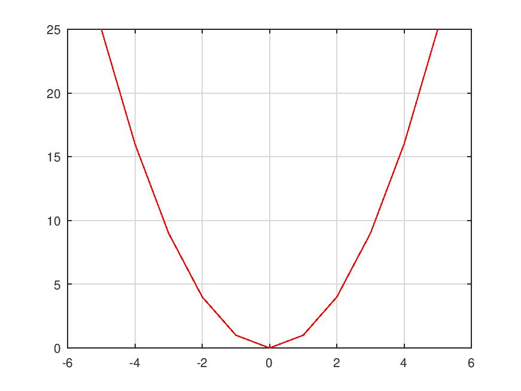

# (PART) Conhecendo o Octave e o Python {-}

# Introdução ao Octave

## Comandos Básicos em Octave 

### Operações Matemáticas

### Vetores e Matrizes

Esta é uma forma de montar uma matriz \(3 \times 3\) em **Octave**
```{octave engine.path="C:/Program Files/GNU Octave/Octave-6.3.0/mingw64/bin/octave-cli-6.3.0.exe"}
A = [1 2 3;4 5 6;7 8 9]
```

Existem alguns comandos que automatizam a criação de algumas matrizes; em algumas ocasiões serão necessárias o uso de **matrizes de zeros** ou da **matriz identidade**, os comandos para elaborar ambas são respectivamente:

```{octave engine.path="C:/Program Files/GNU Octave/Octave-6.3.0/mingw64/bin/octave-cli-6.3.0.exe"}
A = zeros(3,3) %matriz de zeros de dimensao 3 por 3
```
```{octave engine.path="C:/Program Files/GNU Octave/Octave-6.3.0/mingw64/bin/octave-cli-6.3.0.exe"}
A = eye(3,3) %matriz identidade de dimensao 3 por 3
```
### Gráficos
Para gerar o gráficos bidimensionais, define-se os valores do eixo X e depois aplica-se a equação desejada; por exemplo, para $y = x^2 | \ x \in [-5,5]$ pode ser feito

```{octave engine.path="C:/Program Files/GNU Octave/Octave-6.3.0/mingw64/bin/octave-cli-6.3.0.exe"}
x = -5:0.1:5;
y = x.^2;

plot(x,y,'r-')
grid on
print -djpg parabola.jpg
```

> **OBS:** O comando `print -djpg parabola.jpg` não é necessário no Octave, os autores o deixaram no corpo do código apenas para salvar a imagem e assim aplica-lá ao livro.


```{r, echo=FALSE, out.width="50%", fig.align = 'center', fig.cap = "Parábola definida de -5 à 5"}

```


