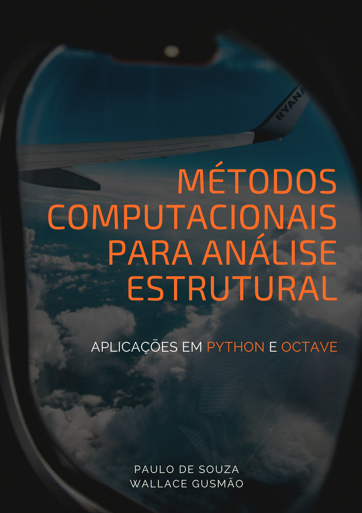

--- 
title: "Métodos Computacionais para Análise Estrutural: Aplicações em Python e Octave"
author: "Paulo de Souza Silva"
date: "`r Sys.Date()`"
site: bookdown::bookdown_site
documentclass: book
bibliography: [book.bib, packages.bib]
# url: your book url like https://bookdown.org/yihui/bookdown
# cover-image: path to the social sharing image like images/cover.jpg
description: |
  This is a minimal example of using the bookdown package to write a book.
  The HTML output format for this example is bookdown::gitbook,
  set in the _output.yml file.
link-citations: yes
github-repo: rstudio/bookdown-demo
---

# Motivação {-}

  

Este livro tem como objetivo ser um material auxiliar para os alunos da disciplina de **Métodos Computacionais para Análise Estrutural** do curso de **Engenharia Aeroespacial** da **Universidade Federal do ABC**. No entanto, o mesmo, tenta abordar de forma clara e concisa os temas referentes a *Álgebra Linear, Cálculo Numério* e *Modelagens Estruturais* para todos aqueles que são intusiastas nesses tópicos.

## Por que ler este livro? {-}

## Sobre os Autores {-}
*Paulo de Souza* é graduando do curso de Engenharia Aeroespacial. Seus interesses são nas áreas de simulação estrutural de aeronaves e aprendizado de máquina com aplicação em frentes da engenharia mecânica.
